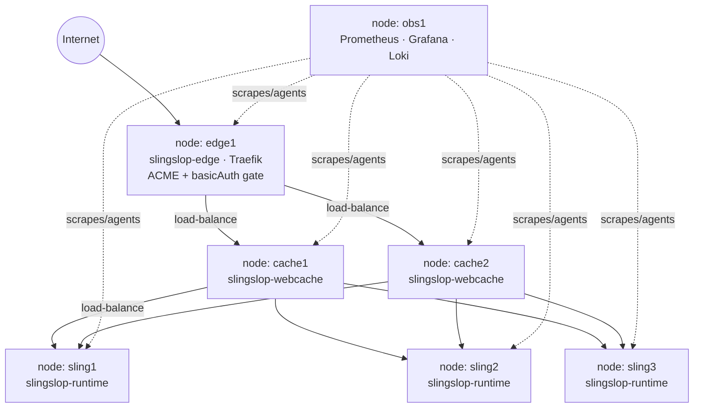

# Slingslop Deployment — from laptop to production

> Opinionated, single-host, low-cost VPS deployment of Slingslop, runnable from
> your laptop today and **GitOps-ready** for tomorrow (e.g. GitHub Actions
> calling the same playbooks).

## Quick start: try it locally with Docker Compose

The fastest way to see Slingslop with its caching reverse proxy in front,
no VPS needed. Two containers — `slingslop` (the Sling app) and `webcache`
(Apache, cached + short URLs) — wired the same way as prod, just smaller.

Requires [Docker](https://docs.docker.com/install/) + [Docker Compose](https://docs.docker.com/compose/install/).

1. **Generate the webcache config** (same CONGA templates prod uses):

   ```bash
   mvn -pl devops/conga -am -DskipTests clean package
   ```

2. **Build & start:**

   ```bash
   docker compose -f devops/docker-compose.yml up --build
   ```

3. **Map the hostnames** to your docker host — add to `/etc/hosts`:

   ```
   127.0.0.1 www.motorbrot.local
   127.0.0.1 zengarden.motorbrot.local
   ```

Then visit http://www.motorbrot.local/ (sling-matrix) or
http://zengarden.motorbrot.local/ (CSS Zen Garden). For content editing, use
plain Sling directly on http://localhost:8080/ — there's no author/editor host
in this sandbox.

Rebuild after changing the webcache template: `docker compose -f devops/docker-compose.yml build --no-cache --force-rm`.
Tear down: `docker compose -f devops/docker-compose.yml down && docker volume rm devops_slingslop-volume`.

This is a sandbox, not the production setup below — one Apache engine, no
Traefik/TLS, no observability stack.

---

Target hosting: a fresh Hetzner CX22 / CPX21 (or equivalent) running
**Debian 12** or **Ubuntu 26.04 LTS**. Single node — no Swarm, no Kubernetes.

## Architecture on the box

```
                       ┌────────── Internet ──────────┐
                                      │
                            :80 / :443 (Let's Encrypt)
                                      │
                            ┌─────────▼─────────┐
                            │      Traefik       │   reverse proxy
                            │  (host network)    │   + ACME + basicAuth gate
                            └─────────┬─────────┘
              ┌───────────────────────┼───────────────────────┐
              │                       │                       │
   www.<DOMAIN>               editor.<DOMAIN>     grafana / logs.<DOMAIN>
   (public, cached)           (author, gated)     (gated, ipAllowList)
              │                       │                       │
       ┌──────▼──────┐                │                ┌──────▼──────┐
       │  webcache    │                │                │   grafana   │
       │  (Apache)    │                │                └──────┬──────┘
       └──────┬──────┘                │                       │
              │                       │                ┌──────▼──────┐
              └───────────┐           │                │ prometheus  │
                          │           │                │   + loki    │
                   ┌──────▼───────────▼──────┐         └──────┬──────┘
                   │       slingslop          │◀────────┐    │
                   │ (composite-NodeStore img)│         │    │
                   └──────────────┬───────────┘    promtail  node-exp
                                  │                          cAdvisor
                          slingslop-content   (named docker volume)
```

All containers live on a single Docker bridge network `slingslop_net`. Only
Traefik publishes ports (80/443). Slingslop, webcache and the observability
stack are reachable only inside that network.

## Compose composition (separate update lifecycles)

Three Compose **files**, one Compose **project** (`COMPOSE_PROJECT_NAME=slingslop`):

| File                              | Owned services                                   |
|-----------------------------------|--------------------------------------------------|
| `/opt/slingslop/compose.edge.yml` | `traefik`, `webcache`                            |
| `/opt/slingslop/compose.app.yml`  | `slingslop`                                      |
| `/opt/slingslop/compose.obs.yml`  | `prometheus`, `grafana`, `loki`, `promtail`, `node-exporter`, `cadvisor` |

Combined operations (Ansible drives these via a small wrapper script
`/opt/slingslop/dc`):

```bash
dc up -d                              # bring everything up
dc pull slingslop                     # pull only the app image
dc up -d --no-deps slingslop          # restart only the app, leave edge & obs alone
dc pull webcache                      # update only the cache
dc up -d --no-deps webcache
```

Traefik keeps proxying during the brief container swap. Sling's startup is
~30–60 s, so user requests see a single short 502 burst — acceptable for a
single-VPS deployment. For true zero-downtime, see *Blue/green note* below.

---

## Concept answers (the user's checklist)

### 1. Secret management

We use **Ansible Vault** for now (single, encrypted file checked into the repo)
and the secrets land on the host as `0600` env-files owned by `root`.
Rationale: zero external dependencies, works offline, identical workflow when
GitHub Actions runs the playbook (`ANSIBLE_VAULT_PASSWORD_FILE` → encrypted
repo secret).

Layout:

| Path | Contents | Encrypted? |
|---|---|---|
| `devops/ansible/inventory/group_vars/all/main.yml`  | non-secret config | no |
| `devops/ansible/inventory/group_vars/all/vault.yml` | every secret (byte-identical on **every** branch) | **yes** (ansible-vault) |
| `/opt/slingslop/secrets/*.env` on host | rendered env-files, `0600 root:root` | n/a |

```bash
# create the vault once
ansible-vault create devops/ansible/inventory/group_vars/all/vault.yml
# edit later
ansible-vault edit   devops/ansible/inventory/group_vars/all/vault.yml
# run plays
ansible-playbook -i inventory/hosts.yml playbooks/site.yml --ask-vault-pass
```

#### One vault, every branch — why merges are safe

The encrypted `vault.yml` is committed **byte-identical on every branch** (main,
feature branches, `deploy/motorbrot_prod`). Because it is the same everywhere, a
merge — including an Agent Smith PR merged through the GitHub UI — is always a
no-op on it: nothing to conflict with, nothing to clobber. Security rests on the
passphrase (the `ANSIBLE_VAULT_PASSWORD` secret), never on the ciphertext, which
is safe to keep in a public repo.

Guardrails:

- **`verify-vault`** decrypts the committed vault and checks sentinel keys before
  any deploy job runs, so a commit that replaced it with a garbled / empty /
  wrong file fails the pipeline before the VPS is touched.
- **CODEOWNERS** requires an owner review to change `group_vars/all/vault.yml`, so
  no app / Agent-Smith PR can quietly edit it.


**GitOps upgrade path:** drop in **sops + age** without changing the play
structure — replace `group_vars/all/vault.yml` with `vault.sops.yml` and add
`community.sops.load_vars`. The host-side rendering is unaffected.

**Secrets we manage:**

- `vault_sling_admin_password` — replaces `admin/admin`
- `vault_traefik_dashboard_htpasswd` — protects `traefik.<DOMAIN>`
- `vault_editor_basicauth_users_htpasswd` — protects `editor.<DOMAIN>`
- `vault_grafana_basicauth_users_htpasswd` — protects `grafana.<DOMAIN>` / `logs.<DOMAIN>`
- `vault_grafana_admin_password`
- `vault_acme_email` — Let's Encrypt registration
- `vault_ssh_admin_pubkey` — public key of the only allowed login user
- `vault_ghcr_pull_user` / `vault_ghcr_pull_token` — optional, for private GHCR pulls

### 1a. Forking with your own secrets

The upstream repo ships **our** encrypted `vault.yml` — you can't decrypt it (no
passphrase) and you don't need to. To run your own instance on your own VPS:

1. Replace the vault with **your** secrets under **your** passphrase:
   ```bash
   cp devops/ansible/inventory/group_vars/all/vault.example.yml \
      devops/ansible/inventory/group_vars/all/vault.yml
   $EDITOR devops/ansible/inventory/group_vars/all/vault.yml
   ansible-vault encrypt devops/ansible/inventory/group_vars/all/vault.yml   # your passphrase
   ```
2. Set your own **`ANSIBLE_VAULT_PASSWORD`** repo secret (Settings → Secrets), and
   point `inventory/` at your VPS.
3. **Keep your vault when pulling upstream updates.** Your `vault.yml` and ours
   share a path. A pull only collides on it when **upstream rotates its vault**
   (otherwise only your side changed it, so git keeps yours automatically). When
   it does collide, keep yours:
   ```bash
   git checkout --ours devops/ansible/inventory/group_vars/all/vault.yml   # during a merge-based pull
   git add devops/ansible/inventory/group_vars/all/vault.yml
   ```
   Or **rebase** your fork on upstream `main` instead of merging — you keep your
   vault while rebasing, no conflict machinery needed.

   Don't reach for `.gitattributes merge=ours`: "always keep the target branch's
   vault" is the *wrong* default for your own rotations (it silently drops a vault
   change you make on `main` when it's merged into `deploy_fork_prod`), and the
   collision it would save you from is a rare, one-command fix anyway.

The local Vagrant harness ignores the vault entirely (throwaway `vault_*` from
`local/vars.local.yml`), so contributors can hack without any passphrase.

### 1b. Editing / rotating the vault (how-to)

All commands run from `devops/ansible/`, decrypting with the passphrase
(`--ask-vault-pass`, or a file holding the `ANSIBLE_VAULT_PASSWORD` — never commit
it):

```bash
V=inventory/group_vars/all/vault.yml

ansible-vault view  $V --ask-vault-pass      # read it
ansible-vault edit  $V --ask-vault-pass      # opens $EDITOR, re-encrypts on save
ansible-vault rekey $V --ask-vault-pass      # change the passphrase

# Encrypt ONE value to paste into a plain YAML file (mixed plain+secret vars):
ansible-vault encrypt_string 'new-pass' --name vault_grafana_admin_password --ask-vault-pass
```

- After changing a credential, apply it:
  `ansible-playbook -i inventory/hosts.yml playbooks/site.yml --ask-vault-pass`
  (or `playbooks/change-admin-password.yml` for just the Sling admin password).
- The file must stay **encrypted** in git — verify its first line is
  `$ANSIBLE_VAULT;1.1;AES256` before you `git add` (the `verify-vault` CI guard
  enforces this on every deploy).

### 2. Docker

Installed from Docker's own apt repo (engine + compose plugin + buildx) via
the `docker` role. The Docker daemon is configured with:

- `log-driver: json-file`, `log-opts: { max-size: 10m, max-file: 3 }` →
  caps every container log at 30 MB on disk.
- `live-restore: true` → daemon restarts don't kill containers.

### 3. Slingslop image (composite NodeStore)

The `slingslop` role pulls `ghcr.io/orx0815/slingslop:snapshot-composite` (see
[`docs/composite-nodestore.md`](../docs/composite-nodestore.md)) and runs it
with two mounts:

| Mount | Purpose | Persistent? |
|---|---|---|
| Volume `slingslop-content` → `/opt/sling/launcher` | mutable JCR (`/content`, `/conf`, `/var`, `/home`) | **yes** |
| Baked-in directory `/opt/sling/seed-repository` | immutable `/apps`, `/libs` (in the image) | n/a |

Upgrading the app is therefore `docker compose pull slingslop && dc up -d --no-deps slingslop`.
The volume is never touched.

### 4. Persistent docker volumes

Named volumes, all under `/var/lib/docker/volumes/` on the host:

- `slingslop_slingslop-content` — JCR repository (the only stateful Sling data)
- `slingslop_traefik-acme` — Let's Encrypt cert + account key
- `slingslop_grafana-data`, `slingslop_prometheus-data`, `slingslop_loki-data`
- `slingslop_webcache-cache` — Apache mod_cache_disk store

The `backup` role snapshots the first one nightly to `/var/backups/slingslop/`
and prunes anything older than 14 days.

### 5. Change the Sling admin password

Per the [Sling FAQ](https://cwiki.apache.org/confluence/display/SLING/FAQ#FAQ-HowdoIchangeJackrabbit'sadminpassword%3F),
we POST to `/system/userManager/user/admin.changePassword.html`. A one-shot
playbook does it idempotently:

```bash
ansible-playbook -i inventory/hosts.yml playbooks/change-admin-password.yml --ask-vault-pass
```

The playbook ships a tiny shell script (`roles/slingslop/files/change-admin-password.sh`)
that:

1. Reads the **current** admin password from a host-side file (or accepts the
   built-in `admin` on first run).
2. Computes the **target** password from the vault.
3. Calls the change endpoint and verifies by logging in with the new one.

If the script can already authenticate with the target password, it exits 0
without doing anything → safe to re-run.

### 6. Webcache

The Apache caching reverse proxy from `devops/webcache/` is reused. The per-app
vhosts are **generated by CONGA** and shipped by the `webcache` role: the whole
`devops/conga/target/configuration/{{ conga_env }}/{{ conga_node }}/webcache/`
directory is copied to `data/webcache/` and compose bind-mounts it over the
image's `sites-enabled`. The Traefik role likewise copies the generated
`traefik/dynamic/router-<app>.yml` file-provider fragments.

> **Adding a public app?** Append one `- tenant:` entry to the matching
> [`devops/conga`](conga/README.md) environment
> (`devops/conga/src/main/environments/<conga_env>.yaml`), rebuild
> (`mvn -pl devops/conga clean package`, or a full `mvn install` which also
> rebuilds the image with the new content), and re-run the playbook. No
> `*.conf.j2` to hand-write; `conga_env`/`conga_node` (group_vars) pick the
> environment whose domain matches this deployment. See
> [docs/conga-config-generation-concept.md](../docs/conga-config-generation-concept.md) §6.

**Three interchangeable engines** (`variant:` on the `slingslop-webcache` role):
`apache` (default), `nginx` and `varnish` — all rendered from the **same** tenant
parameters. Per-app tuning (allow lists, extra domains, uncached patterns, JSON
allow-list, deny rules, TTLs) and the engine trade-offs are in
[devops/webcache.md](webcache.md). To add a knob that doesn't exist yet,
see [devops/conga-handlebars-101.md](conga-handlebars-101.md).

### 7. Monitoring (Grafana)


`monitoring` role brings up **Prometheus + Grafana + node-exporter + cAdvisor**.
Grafana is provisioned (datasources, starter dashboards) from
`roles/monitoring/files/`. Public URL: `https://grafana.<DOMAIN>/`,
gated by Traefik basicAuth (see §10).

Three dashboards ship out of the box:

| Dashboard | uid | Source | What it shows |
|---|---|---|---|
| **Slingslop — Host** | `slingslop-host` | node-exporter | Load, uptime, memory (used/swap/breakdown), root filesystem usage, CPU by mode, disk I/O, network I/O. |
| **Slingslop — Containers** | `slingslop-containers` | cAdvisor + Loki | Per-container CPU/memory/network, slingslop's memory vs. its configured limit and CPU throttling, a container count, and a `$container`-driven Loki logs panel. |
| **Slingslop — Sling / Oak** | `slingslop-sling` | Sling's own `/metrics` | See below. |

#### ⚠️ cAdvisor version pin matters

`cadvisor_image` was bumped from `gcr.io/cadvisor/cadvisor:v0.49.1` to
`ghcr.io/google/cadvisor:v0.60.5`. The old pin (2023-era) could not read
per-container cgroups on a modern Docker/overlay2 host — every container-level
panel silently showed **no data**, logging
`failed to identify the read-write layer ID for container "...": ... mount-id:
no such file or directory` — while machine-wide node-exporter metrics kept
working fine, masking the problem. If the Containers dashboard ever goes blank
again after a host OS/Docker upgrade, check `docker logs slingslop-cadvisor`
for that error first and bump the image (cAdvisor v0.56.0+ dropped support for
Docker < 25.0, so keep both in step).


#### Sling / Oak metrics

Sling exposes its Dropwizard metrics registry (JVM, Oak, `org.apache.sling.*`)
in Prometheus format at `/metrics`, unauthenticated, via the
[`org.apache.sling.commons.metrics.prometheus`](https://github.com/apache/sling-org-apache-sling-commons-metrics-prometheus)
bundle — added together with its `io.prometheus:simpleclient*:0.10.0`
dependencies in [`launcher/src/main/features/launcher.json`](../launcher/src/main/features/launcher.json).
Prometheus scrapes it as the `sling` job (`prometheus.yml.j2`), and the
**"Slingslop — Sling / Oak"** dashboard (`roles/monitoring/files/sling.json`)
visualizes it: JVM heap/threads, Oak query/commit timings, commit queue size,
segment cache hit ratio, JCR login errors, discovery cluster instances, Sling
event-job queues, scheduler running jobs, unclosed-ResourceResolver leak
counter, and thread-pool utilization. Metric names were confirmed against a
live instance (`curl localhost:8080/metrics`) rather than guessed — see
Robert Munteanu's ["Sling applications: a DevOps perspective"](https://adapt.to/2023/robert-munteanu-sling-applications-a-devops-perspective.html)
(adaptTo() 2023, monitoring section) for the source of the approach.

#### Dashboards as code — edit in prod, sync back to git manually

Dashboards are provisioned from files (`roles/monitoring/files/*.json` →
`{{ slingslop_root }}/data/grafana/dashboards/` on the host) with
`allowUiUpdates: true`. That means:

- Editing a dashboard's panels in the Grafana UI and clicking **Save**
  writes the change straight back to the JSON file on disk (no "cannot save
  provisioned dashboard" prompt).
- Ansible only **seeds** each dashboard file on first deploy (`force: false`)
  — re-running `site.yml` never clobbers edits made live that haven't been
  copied back to git yet.
- There is **no automated export**. To persist a prod edit, manually pull the
  file back into the repo and commit it, e.g.:
  ```bash
  scp deploy@<host>:/opt/slingslop/data/grafana/dashboards/sling.json \
      devops/ansible/roles/monitoring/files/sling.json
  git add devops/ansible/roles/monitoring/files/sling.json
  ```
  (Or use Grafana's Dashboard settings → JSON Model → copy, and paste over
  the file by hand.)
- To add a brand-new dashboard, drop a `<name>.json` export into
  `roles/monitoring/files/` and add it to the `loop` in
  `roles/monitoring/tasks/main.yml` ("Ship starter dashboards").

#### ⚠️ Adding new bundles to the feature model on an existing deployment

Rolling out a **new bundle set** (like the Prometheus exporter above) onto a
host whose `slingslop-content` volume already has a JCR + Felix bundle cache
from an *older* feature model can crash-loop the container with
`org.osgi.framework.BundleException: Bundle symbolic name and version are not
unique: ...`. Felix's persistent bundle cache (`framework/` inside the
volume) can get out of sync with a changed bundle list on restart — this bit
the local Vagrant test VM (whose volume predated this change) and was fixed by
wiping the *test* volume (`docker volume rm slingslop_slingslop-content`) for a
clean re-bootstrap. This has **not** been hit on the real prod host yet, but
plan for it before rolling this specific change out: verify a plain `dc pull
&& dc up -d --no-deps slingslop` still comes up cleanly, and if not, be
prepared that a bundle-set change (as opposed to a routine version bump of
already-known bundles) may need a framework-cache reset.

### 7a. Traefik dashboard

Enabled by default (`traefik_dashboard_enabled: true` in
`group_vars/all/main.yml`). Reachable at:

```
https://traefik.<DOMAIN>/
```

(e.g. `https://traefik.slingslop.local/` on the local test VM.)

It is gated by the same two barriers as the editor/grafana endpoints:

1. **basicAuth** from `vault_traefik_dashboard_htpasswd` — generate the entry
   with `docker run --rm httpd:2.4 htpasswd -nbB admin '<password>'`.
2. **ipAllowList** — if `editor_allowlist_cidrs` is set, the dashboard is
   restricted to those ranges too.

The unauthenticated `:8080` insecure API is **off** (`api.insecure: false`);
the dashboard is only served through the authenticated `traefik.<DOMAIN>`
router (`api@internal`). Set `traefik_dashboard_enabled: false` to remove it
entirely (router, middleware, and mounted htpasswd all disappear).

### 8. Log viewer (why **not** OpenSearch on a low-cost VPS)

OpenSearch needs ≥ 2 GB RAM just to idle, ~6 GB to be comfortable, and a
non-trivial JVM dance. That is too much for a CX22-class node sitting next to
a Java app.

We use **Grafana Loki + Promtail** instead:

- Loki: ~150 MB RSS, fits on the smallest droplet.
- Promtail: tails the Docker socket → every container's stdout/stderr.
- Same Grafana that shows metrics shows logs (Explore → Loki).

Retention is **14 days** by default, configurable in
`group_vars/all/main.yml`. Loki's `compactor` deletes anything older.

If the project outgrows Loki, swapping in OpenSearch is a single role swap —
nothing else in the deployment cares.

### 9. Disk-fill protection

Three independent caps:

| Source | Cap |
|---|---|
| Docker container logs | `max-size: 10m, max-file: 3` per container |
| Loki stored chunks | `retention_period: 14d` (compactor) |
| Prometheus TSDB | `--storage.tsdb.retention.time=14d --storage.tsdb.retention.size=2GB` |
| Nightly backups | keep last 14 in `/var/backups/slingslop/` |
| Apache access/error logs (inside webcache) | log driver caps already apply |
| Apt cache, journal, old kernels | `apt-get autoremove` + `journalctl --vacuum-time=14d` weekly cron |

### 10. "Additional barrier" to editor / grafana / logs

Two layers, both via Traefik middlewares:

1. **basicAuth** (`vault_editor_basicauth_users_htpasswd`,
   `vault_grafana_basicauth_users_htpasswd`) — a second login *before* Sling's
   or Grafana's own login. Failed attempts are captured by fail2ban (see §11).
   The Traefik dashboard (§7a) is gated the same way via
   `vault_traefik_dashboard_htpasswd`.
2. **ipAllowList** (commented out in `roles/traefik/templates/dynamic.yml.j2`)
   — uncomment and set `editor_allowlist_cidrs` in `group_vars/all/main.yml` to
   restrict the editor URL to a VPN / office IP range.

The public `www.<DOMAIN>` has **no** middleware in front of it.

### 11. Prod-level security

The `security`, `users` and `firewall` roles implement:

- A dedicated unprivileged user (`deploy`), no root SSH, no password SSH.
- `~/.ssh/authorized_keys` from `vault_ssh_admin_pubkey` (Ed25519 keys only).
- `sshd_config` hardening: `PermitRootLogin no`, `PasswordAuthentication no`,
  `KbdInteractiveAuthentication no`, `PubkeyAuthentication yes`,
  `AllowUsers deploy`, `LoginGraceTime 20`, `MaxAuthTries 3`,
  `ClientAliveInterval 300`.
- **`AuthorizedKeysCommand` optional**: ready to flip to short-lived
  SSH certificates signed by your CA — see `roles/security/README.md`.
- `ufw`: default-deny inbound, allow `22/tcp`, `80/tcp`, `443/tcp` only.
- `fail2ban`: jails for `sshd` **and** Traefik basicAuth (custom filter
  parsing Traefik access logs).
- `unattended-upgrades`: security patches applied automatically; weekly
  `apt-get autoremove`.
- Kernel hardening: `sysctl` defaults from `roles/security/files/99-hardening.conf`
  (rp_filter, tcp_syncookies, disable ICMP redirect accept, IPv6 RA off
  unless `ipv6_enabled=true`).
- **Docker bind-mount discipline**: no host paths leak into containers
  except `/var/run/docker.sock` for cAdvisor/Promtail (read-only).
- Container hardening: `read_only: true` where possible, `cap_drop: [ALL]`,
  `no-new-privileges: true`.
- Outbound egress not restricted (a firewall on egress breaks ACME challenges
  and `docker pull`); host-level auditing via `auditd` is left as an opt-in
  in `group_vars/all/main.yml` (`enable_auditd: true`).

### 12. SSL cert auto-renewal

Done by **Traefik's built-in ACME client** (HTTP-01 challenge on port 80).
Renewals run every 12 h; certs persist in the `traefik-acme` volume.
Zero extra cron jobs, zero certbot.

If you ever need DNS-01 (wildcards), drop in a Traefik provider block — see
`roles/traefik/templates/traefik.yml.j2` comments.

### 13. Independent updates of slingslop and webcache

See *Compose composition* above. Day-to-day:

```bash
ansible-playbook -i inventory/hosts.yml playbooks/update-slingslop.yml --ask-vault-pass
ansible-playbook -i inventory/hosts.yml playbooks/update-webcache.yml  --ask-vault-pass
```

Both playbooks:

1. `docker compose pull` *only* the targeted image.
2. `docker compose up -d --no-deps <service>` — leaves the other stack
   untouched.
3. Wait for the service's healthcheck to pass before exiting.

**Blue/green note (future):** to drive downtime to ~0 s, run two Sling
containers behind Traefik with weighted routing, swap weights to 0/100,
then remove the drained one. Doable on the same VPS but adds RAM pressure;
not included in v1.

### 14. Do we need our own Docker registry?

**No.** Push images to **GHCR** (`ghcr.io/orx0815/slingslop:*` already exists
in the project). On the VPS:

- For **public** images: anonymous pull, no credentials needed.
- For **private** images: one `docker login ghcr.io -u <bot> --password-stdin`
  on the host using a short-lived GitHub PAT stored in the vault
  (`vault_ghcr_pull_token`). The `docker` role writes
  `/root/.docker/config.json` automatically when that variable is set.

An on-host registry only pays off if you start producing a lot of large
images often *and* GHCR egress becomes a bottleneck — neither applies to a
single-VPS Slingslop deployment.

---

## Repository layout

```
devops/
├── README.md                          ← this file
└── ansible/
    ├── ansible.cfg
    ├── requirements.yml               ← galaxy collections
    ├── inventory/
    │   ├── hosts.example.yml
    │   └── group_vars/
    │       └── all/
    │           ├── main.yml           ← all non-secret config
    │           └── vault.example.yml  ← copy → vault.yml, then ansible-vault encrypt
    ├── playbooks/
    │   ├── bootstrap.yml              ← run once as root (or via cloud-init's root)
    │   ├── site.yml                   ← full convergence
    │   ├── update-slingslop.yml
    │   ├── update-webcache.yml
    │   └── change-admin-password.yml
    └── roles/
        ├── common/                    hostname, timezone, base pkgs
        ├── users/                     deploy user + SSH key
        ├── security/                  sshd, fail2ban, sysctl, unattended-upgrades
        ├── firewall/                  ufw
        ├── docker/                    engine + compose + daemon.json
        ├── traefik/                   reverse proxy + ACME + middlewares
        ├── slingslop/                 app + admin-password rotation
        ├── webcache/                  Apache mod_cache_disk
        ├── monitoring/                prometheus + grafana + exporters
        ├── logging/                   loki + promtail
        └── backup/                    nightly volume snapshot + retention
```

## Quick start

```bash
# 0. One-time on your laptop
pip install --user "ansible-core>=2.16" passlib
ansible-galaxy collection install -r devops/ansible/requirements.yml

# 1. Copy + fill the inventory
cp devops/ansible/inventory/hosts.example.yml devops/ansible/inventory/hosts.yml
$EDITOR devops/ansible/inventory/hosts.yml      # ansible_host, ansible_user etc.

# 2. Copy the secrets template, then fill it in
cp devops/ansible/inventory/group_vars/all/vault.example.yml \
   devops/ansible/inventory/group_vars/all/vault.yml
$EDITOR devops/ansible/inventory/group_vars/all/vault.yml
```

> ### 2a. Generate the basicAuth (htpasswd) values
>
> Three of the vault vars are **htpasswd entries** (`user:hash`), not plain
> passwords — they are the basicAuth gate in front of the Traefik-fronted
> endpoints:
>
> | Vault var | Protects |
> |---|---|
> | `vault_traefik_dashboard_htpasswd` | `traefik.<domain>` dashboard |
> | `vault_editor_basicauth_users_htpasswd` | `editor.<domain>` (author UI) |
> | `vault_grafana_basicauth_users_htpasswd` | `grafana.<domain>` / `logs.<domain>` |
>
> Generate each entry with `htpasswd` (bcrypt, `-B`) and paste the whole
> `user:hash` line into the matching var — do this **before** you encrypt:
>
> ```bash
> # local (needs: apt install apache2-utils)
> htpasswd -nbB admin '<password>'
> # or, no local install:
> docker run --rm httpd:2.4 htpasswd -nbB admin '<password>'
> ```
>
> The username you pass (`admin`, `editor`, `ops`, …) becomes the basicAuth
> login. The `*_users_*` vars accept multiple lines (one `user:hash` per line,
> under the `|` block scalar). `vault_sling_admin_password` and
> `vault_grafana_admin_password` are **plain** passwords — do *not* run those
> through `htpasswd`.

> ### 2b. The SSH keys — get this right or you lock yourself (or CI) out
>
> `vault_ssh_admin_pubkey` is a **public** key (or several) that the `users`
> role writes into the `deploy` user's `~/.ssh/authorized_keys` with
> **`exclusive: true`** — meaning it **replaces every other key**. Only keys
> listed here can log in as `deploy`. It is *not* derived from any GitHub
> secret; you paste it in by hand.
>
> There are two different keys, and they are two halves of two different things:
>
> | Key | Kind | Lives in | Used by |
> |---|---|---|---|
> | `vault_ssh_admin_pubkey` | **public** | this vault file → box `authorized_keys` | anyone with the matching private key |
> | `DEPLOY_SSH_KEY` | **private** | GitHub Actions secret | CI, to SSH in as `deploy` |
> | your laptop key | private (yours) | `~/.ssh/` on your laptop | you, for manual SSH |
>
> Because the install is **exclusive**, `vault_ssh_admin_pubkey` must contain
> **every** public key that should have access — at minimum the CI deploy key
> *and* your laptop key. List only one and the other is locked out.
>
> Recommended: generate a **dedicated deploy keypair** (never hand your personal
> private key to GitHub):
>
> ```bash
> ssh-keygen -t ed25519 -C deploy@slingslop -f deploy_ed25519 -N ""
> cat deploy_ed25519.pub          # → add to vault_ssh_admin_pubkey
> cat deploy_ed25519              # → paste into the GitHub secret DEPLOY_SSH_KEY (private!)
> ```
>
> Then `vault_ssh_admin_pubkey` holds both keys (newline-separated — the
> `authorized_key` module installs them all):
>
> ```yaml
> vault_ssh_admin_pubkey: |
>   ssh-ed25519 AAAA...your-laptop-pubkey... you@laptop
>   ssh-ed25519 AAAA...deploy-ci-pubkey...   deploy@ci
> ```
>
> **Warning:** the next `site.yml` (or `infra.yml → site`) run overwrites
> `deploy`'s `authorized_keys` with exactly this value. Make sure both keys are
> present **before** you run it, or you drop your own access.

```bash
# ...once vault.yml is fully filled in (htpasswd + SSH keys), encrypt it in place
ansible-vault encrypt devops/ansible/inventory/group_vars/all/vault.yml
```

> ### 2c. Commit the *encrypted* vault (this is what makes GitOps work)
>
> `ansible-vault`-encrypted files are safe to commit — that is the whole point.
> The encrypted `vault.yml` **is** committed to the repo; CI decrypts it with the
> `ANSIBLE_VAULT_PASSWORD` secret. (The `.gitignore` no longer ignores it.)
>
> ```bash
> head -1 devops/ansible/inventory/group_vars/all/vault.yml   # MUST print: $ANSIBLE_VAULT;1.1;AES256
> git add -f devops/ansible/inventory/group_vars/all/vault.yml
> ```
>
> **Never** commit an unencrypted vault — always verify that first line before
> `git add`. The `ANSIBLE_VAULT_PASSWORD` GitHub secret is only the *passphrase*;
> without the committed encrypted file, CI has no secrets to decrypt.

```bash
# 3. Bootstrap (as root, once)
# NOTE: inventory pins `ansible_user: deploy`, which outranks `-u root`, so pass
# `-e ansible_user=root` (extra-vars win) to connect as root for this first run.
# Add `-k` only if root accepts a PASSWORD (requires the sshpass program);
# omit it when root accepts your SSH key (cloud-init / provider-added key).
cd devops/ansible
ansible-playbook -i inventory/hosts.yml playbooks/bootstrap.yml \
    -e ansible_user=root --ask-vault-pass

# 4. Full deploy (as deploy user from then on)
ansible-playbook -i inventory/hosts.yml playbooks/site.yml --ask-vault-pass

# 5. Verify
curl -I https://www.<your-domain>/
curl -I -u admin:<vault-pass> https://editor.<your-domain>/
curl -I -u admin:<vault-pass> https://grafana.<your-domain>/
```

## Local testing (Vagrant VM)

You can rehearse the **entire deployment on your laptop** against a throwaway
Ubuntu 24.04 VM before pointing it at a real VPS. This runs the *actual*
`bootstrap.yml` + `site.yml` — the only differences from prod are a local
domain, self-signed TLS (no Let's Encrypt on a private box), and throwaway
secrets. All of it lives in [`devops/ansible/local/`](ansible/local/).

Requires **Vagrant + VirtualBox** on the host (Ansible itself is installed into
a local venv by the script — nothing global needed).

> **VirtualBox ≥ 7.1 required for the default `bento/ubuntu-26.04` box.** That
> box is EFI/NVRAM (OVF `ResourceType 32768`); VirtualBox 7.0 and older can't
> import it and fail with:
>
> ```
> VBoxManage: error: Unknown resource type 32768 in hardware item, line 49
> ```
>
> Two fixes: upgrade VirtualBox to 7.1.x, **or** stay on 7.0 and use the
> BIOS-based 24.04 box via the override:
>
> ```bash
> SLINGSLOP_VM_BOX=bento/ubuntu-24.04 ./test-local.sh up
> ```

The `slingslop` and `webcache` images on GHCR are **private**, so the VM needs a
pull token. Export a GitHub PAT (scope `read:packages`) before running — it is
injected into a gitignored runtime file and never committed:

```bash
export GHCR_USER=<your-github-user>
export GHCR_TOKEN=<PAT with read:packages>
```

```bash
cd devops/ansible/local

./test-local.sh up          # boots the VM, runs bootstrap + site end-to-end
./test-local.sh hosts       # prints the /etc/hosts lines to add
./test-local.sh site        # re-run site.yml only (idempotency check)
./test-local.sh ssh         # SSH into the VM as the deploy user
./test-local.sh destroy     # tear the VM down
```

After `up`, add the printed line to your host's `/etc/hosts`, e.g.:

```
192.168.56.50 slingslop.local www.slingslop.local editor.slingslop.local grafana.slingslop.local logs.slingslop.local
```

Then browse (accept the self-signed certificate):

- `https://www.slingslop.local/` — public, cached site
- `https://editor.slingslop.local/` — basicAuth `localtest` / `localtest`, then the Sling author UI
- `https://grafana.slingslop.local/` — basicAuth `localtest` / `localtest`

How the local mode differs from prod (all via `-e @local/vars.local.yml`):

| Setting | Prod default | Local override |
|---|---|---|
| `domain` | your real domain | `slingslop.local` |
| `traefik_acme_enabled` | `true` (Let's Encrypt) | `false` (Traefik self-signed cert) |
| `ssh_allowed_users` | `[deploy]` | `[deploy, vagrant]` (so `vagrant ssh` keeps working) |
| secrets / vault | `ansible-vault` file | throwaway plaintext in `local/vars.local.yml` |

The new `traefik_acme_enabled` flag is the only change to the shared roles — it
defaults to `true`, so **production behaviour is unchanged**. VM tuning knobs:
`SLINGSLOP_VM_IP`, `SLINGSLOP_VM_MEM`, `SLINGSLOP_VM_CPUS`, `SLINGSLOP_VM_BOX`
(env vars — `SLINGSLOP_VM_BOX` picks the base box, e.g. `bento/ubuntu-24.04` on
VirtualBox 7.0).

## GitOps (implemented — `.github/workflows/`)

Two workflows drive CI/CD:

### `ci-cd.yml` — on push to `main` and `deploy/motorbrot_prod`

| Stage | main | deploy/motorbrot_prod |
|---|---|---|
| build + integration tests | ✅ | ✅ |
| push images (GHCR) | ✅ all | ✅ only what changed |
| deploy to the VPS | — | ✅ path-selective |

Key behaviours:

- **Immutable image per commit.** Every build tags `sha-<commit>` (and a moving
  `snapshot` / `motorbrot_prod` tag). The deploy installs the **`sha-<commit>`**
  image, so a branch deploy can never accidentally pull `main`'s image.
- **All images live on GHCR only** (`slingslop`, `slingslop-*composite*`,
  `slingslop-webcache`). No Docker Hub.
- **Path-selective deploy** (`dorny/paths-filter`):
  - `sling-apps/**`, `launcher/**`, `content-packages/**`, `pom.xml` → deploy
    the Sling app (`update-slingslop.yml`).
  - `devops/webcache/**` → deploy webcache (`update-webcache.yml`).
  - Both changed → **sling first**, gated on readiness, **then** webcache.
- **Readiness gate.** `update-slingslop.yml` waits for
  `/system/health.json?tags=systemalive` → `200` (the "OSGi Framework Ready" +
  "Services Ready" checks). The overall endpoint is `503` because of the
  non-fatal JCR-maintenance critical ("DataStoreCleanupScheduler not
  registered"), so we deliberately filter to the `systemalive` tag.
- **Webcache keeps serving.** Only the `webcache` service is recreated
  (`--no-deps`); Traefik and the `webcache-cache` volume are untouched.

### `infra.yml` — manual (`workflow_dispatch`)

Runs the one-off infrastructure convergence, **not** on push:

- `site` — full `site.yml` as `deploy` (re-run after role/config changes).
- `bootstrap` — `bootstrap.yml` as root on a **fresh** box (needs `ROOT_SSH_KEY`;
  normally done once from a laptop).

Day-to-day app/webcache updates are automatic via `ci-cd.yml`; you only reach
for `infra.yml` when the box itself (Traefik, monitoring, users, …) changes.

### Required GitHub config

> **One-time github.com setup — secrets, variables, the `production`
> environment, and GHCR package access/visibility — is documented step-by-step
> in [`github-setup.md`](github-setup.md).** Summary:

| Kind | Name | Purpose |
|---|---|---|
| secret | `DEPLOY_SSH_KEY` | private key allow-listed for the `deploy` user |
| secret | `ANSIBLE_VAULT_PASSWORD` | decrypts `group_vars/all/vault.yml` |
| secret | `ROOT_SSH_KEY` | *(bootstrap only)* root key for a fresh box |
| variable | `DEPLOY_HOST` | SSH target (default `motorbrot.org`) |
| variable | `DEPLOY_DOMAIN` | published domain (default `motorbrot.org`) |

The deploy jobs generate the (gitignored) inventory at runtime via
`.github/scripts/write-inventory.sh` from `DEPLOY_HOST` / `DEPLOY_DOMAIN`.

> **Images must be public** on GHCR for the host's anonymous pull to work, and
> each package must grant this repo **Write** access or the push is `denied` —
> see [`github-setup.md`](github-setup.md#4-ghcr-package-access--visibility-fixes-denied-on-push).
> `deploy/motorbrot_prod` is a protected `production` environment — add required
> reviewers in the repo settings if you want a manual approval gate.

---

## Scaling out: a multi-node topology (concept)

> _"Can I run 5 nodes — 1× Traefik, 2× webcache, 3× Sling, 1× observation?"_
> **Yes** — with one real architectural decision to make (the Sling tier). This
> section is a concept, not a wired-up feature: nothing below is implemented yet.

### Why most of it is already there

Slingslop's deploy config is **node/role-oriented from day one**. A CONGA
environment (e.g. [`devops/conga/src/main/environments/prod-motorbrot.yaml`](conga/src/main/environments/prod-motorbrot.yaml))
is a **list** of nodes, each picking a set of roles:

```yaml
nodes:
- node: vps1
  roles:
  - { role: slingslop-edge,    variant: acme }        # Traefik
  - { role: slingslop-webcache, variant: apache }      # Apache cache
  - { role: slingslop-runtime,  variant: composite-nodestore }  # Sling
```

Today all three roles land on **one** node, but the model imposes no such limit.
Splitting them across five hosts is a config change plus a five-host inventory —
CONGA already emits one config directory per node
(`.../configuration/<env>/<node>/`), and Ansible already selects a node's slice
via `conga_node`. The GitOps edge-deploy (`deploy-tenant-edge.yml`) and Pattern A
shipping work the same regardless of how many nodes exist.

So the desired layout maps cleanly:



### What needs to change — three things, one of them is the crux

**1. Routing templates must become multi-valued (small).**
- Traefik natively load-balances: its router service takes a **list** of
  `servers:` URLs. Today [`slingslop-edge/router.yml.hbs`](conga/src/main/templates/slingslop-edge/router.yml.hbs)
  emits a single `backendHost:backendPort`; it would iterate a list (the 2
  webcaches).
- Apache webcache proxies to a single `${RENDERER_URL}:8080`; to fan out to 3
  Slings it uses `mod_proxy_balancer` (`BalancerMember` ×3) or points at an
  internal LB. A template + module change, not a redesign.

**2. Cross-host networking (medium).** Today every container shares one Docker
bridge (`slingslop_net`) on one box, so service names resolve for free. Across 5
hosts, `RENDERER_URL` / the Traefik server URLs become **real
private addresses** (a private LAN, WireGuard, or a Swarm/overlay), with
firewalling so only the edge is public. These are exactly the kind of values
CONGA is good at carrying per-environment.

**3. The Sling tier — the one genuine decision.** Oak's **SegmentNodeStore
(TarMK)**, which Slingslop uses (see [`docs/composite-nodestore.md`](../docs/composite-nodestore.md)),
is **single-writer, single-JVM — it cannot be clustered**. Three Sling
instances therefore *cannot* share one writable Segment store. So you don't
cluster the store — you either **replicate** it (Option A) or **replace** it with
a clustered store (Option B). This is exactly the split AEM has used under heavy
load for ~16 years:

| Option | How | Cost | Fits Slingslop? |
|---|---|---|---|
| **A — Author/Publish split** _(the classic model, no new infra)_ | 1 **author** Sling stays writable (Tiptap inline editing — the existing `gated`/`editor` host already is this). The 3 (or N) **publish** Slings each keep their **own independent TarMK repo**, kept in sync from the author by **[Sling Content Distribution](https://sling.apache.org/documentation/bundles/content-distribution.html)** (SCD): a *forward* distribution agent on the author pushes FileVault packages to a local importer on each publish (`POST …/services/agents/publish action=ADD path=/content/…`, or event-triggered). Each publish is single-writer of its *own* store, so no Oak clustering is needed; publish nodes scale horizontally behind the webcaches. | No database. Each publish holds a full copy of `/content` (binary-less mode over a shared datastore avoids copying blobs). Live author→publish replication is a real component to run (agents, queues, retry/error-queue strategy) — but that is precisely what SCD provides. | **Best fit.** Content here is **authored**, not baked sample data, so replication (SCD) — not image reseeding — is the correct mechanism. Mirrors AEM author/publish. |
| **B — Shared-write cluster** | Swap the `composite-global` store from SegmentNodeStore to Oak **DocumentNodeStore** on **MongoDB** (or RDB/JDBC). All 3 Slings become read-write **clustered**, sharing one repo; each still bakes `/apps` read-only via composite. This is *the* Oak-sanctioned way to run N writable Sling nodes. | Adds a **stateful DB tier** → effectively a **6th node** (Mongo replica set / Postgres) with its own backups, and the DB becomes the scaling bottleneck / SPOF to design around. | Heavier. This is what AEM reaches for when **one author instance isn't enough** (author clustering). Choose only when a single writable author is the bottleneck. |

### The observation node

The observability stack already exists as its own compose file
(`compose.obs.yml`: Prometheus, Grafana, Loki, promtail, node-exporter,
cAdvisor — see §7 *Monitoring* above). Promoting it to a dedicated 5th node
means: a new `slingslop-observation` CONGA role that carries the central
**Prometheus + Grafana + Loki** on `obs1`, plus **lightweight agents** (promtail /
node-exporter / cAdvisor) running on *every* node and pointing back at `obs1`.
Conceptually straightforward; it's a role split, not new technology.

### Verdict

- **Config-generation & ops layers:** already multi-node capable (CONGA
  nodes + roles, per-node config selection, Pattern A + GitOps shipping). Adding
  nodes is mostly a data change plus a bigger inventory.
- **Routing templates:** need to become multi-backend (Traefik server list;
  Apache balancer) — small, mechanical.
- **The only real design decision:** how the 3 Slings stay in sync. Go
  **Option A** (author + N publish, kept in sync by **Sling Content
  Distribution** — no database, the classic AEM model and the natural fit for
  authored content) unless a single writable author becomes the bottleneck, in
  which case **Option B** (DocumentNodeStore + MongoDB author cluster, and budget
  a 6th DB node).

> **Not now, though.** A single cheap VPS running the current all-in-one node
> gets you a long way; the point of this section is that the scaling path is
> already laid out. An **author/publish variant of Slingslop** (SCD wiring, a
> `slingslop-author` vs `slingslop-publish` runtime role, publish load-balancing)
> is a deliberate future step — the exact topology depends on the use case and
> load, and there are certainly more architectures than these two.
