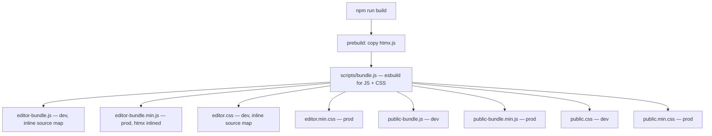

# Frontend Build (JS + CSS)

This directory contains all source TypeScript and CSS for the Sling/HTL-based Zen Garden editor.
Bundling is done with **esbuild** (JS + CSS), orchestrated by `scripts/bundle.js`.
No SCSS, no PostCSS — plain modern CSS with native nesting.

---

## Directory Structure

```
frontend/
├── scripts/
│   └── bundle.js           ← build orchestrator, run via npm run build
├── src/
│   ├── typescript/
│   │   ├── editor.ts       ← editor bundle entry point
│   │   ├── public.ts       ← public bundle entry point (placeholder)
│   │   └── editor/         ← editor submodules (imported by editor.ts)
│   │       ├── state.ts        shared mutable state
│   │       ├── tiptap.ts       Tiptap init/destroy + all extensions
│   │       ├── toolbar.ts      toolbar actions, state updates, wiring
│   │       ├── component-modal.ts  modal show/hide/mount/wire
│   │       └── save.ts         save & htmx submit
│   └── css/
│       ├── editor/
│       │   ├── editor.css          entry — @imports all partials
│       │   ├── 01-modal-overlay.css
│       │   ├── 02-modal-dialog.css
│       │   ├── 03-buttons.css
│       │   ├── 04-toolbar.css
│       │   ├── 05-tiptap-editor.css
│       │   └── 06-inline-editor.css
│       └── public/
│           └── public.css          entry / placeholder
├── package.json
└── FRONTEND_README.md      ← you are here
```

---

## Two Bundles

| Bundle   | JS entry                    | CSS entry                       | Purpose                            |
|----------|-----------------------------|---------------------------------|------------------------------------|
| `editor` | `src/typescript/editor.ts`  | `src/css/editor/editor.css`     | Edit mode: Tiptap, modals, toolbar |
| `public` | `src/typescript/public.ts`  | `src/css/public/public.css`     | Public pages (placeholder)         |

Each bundle is emitted as both a plain (development) and a minified (production) file.

---

## Output Files

Outputs land under the JCR content path after the Maven build:

```
src/main/resources/apps/zengarden/clientlibs/
├── js/
│   ├── editor/
│   │   ├── editor-bundle.js        ← plain JS
│   │   └── editor-bundle.min.js    ← minified JS + inlined htmx banner
│   ├── public/
│   │   ├── public-bundle.js
│   │   └── public-bundle.min.js
│   └── htmx.js                     ← htmx dev copy (loaded separately in ?minLibs=no mode)
└── css/
    ├── editor/
    │   ├── editor.css
    │   └── editor.min.css
    └── public/
        ├── public.css
        └── public.min.css
```

---

## NPM Scripts

| Script           | What it does                                                           |
|------------------|------------------------------------------------------------------------|
| `npm run build`  | Full build: dev + minified JS/CSS (`prebuild` copies htmx first)       |
| `npm run watch`  | Watch mode: rebuild dev JS/CSS on every file save (`?minLibs=no` only) |
| `npm run check`  | Prettier format check + ESLint + TypeScript typecheck                  |
| `npm run format` | Auto-fix formatting with Prettier                                      |
| `copy:htmx`      | Copy `htmx.js` from node_modules to output folder                     |

The `prebuild` hook runs `copy:htmx` automatically before every `npm run build`.

---

## Build Pipeline



---

## CSS Build Details

CSS is bundled by **esbuild** — the same tool used for JS.

- **`@import` resolution** — esbuild resolves all `@import` statements natively
- **Native nesting** — partials use CSS nesting (`& .child`, `&:hover`, etc.) directly; no transpilation needed
- **Dev output** (`.css`) — unminified with an inline source map; open DevTools → Sources to navigate per-partial
- **Prod output** (`.min.css`) — minified, no source map

### Adding a new CSS partial

1. Create a new file under `src/css/<bundle>/` (e.g. `07-my-component.css`)
2. Add `@import './07-my-component.css';` at the bottom of the bundle entry (`editor.css` or `public.css`)
3. Run `npm run build`

---

## TypeScript Module Architecture

`editor.ts` is the bundle entry and wires everything together at runtime:

```
editor.ts
├── editor/state.ts           shared singleton: { editor, isSourceView }
├── editor/tiptap.ts          initializeTiptap(), destroyEditor(), all extension imports
├── editor/toolbar.ts         setupToolbar(), handleToolbarAction(), updateToolbarState()
├── editor/component-modal.ts showComponentModal(), hideComponentModal(), wireComponentModal()
└── editor/save.ts            saveEditorContent()
```

`state.ts` is intentionally kept as a dumb object to avoid circular deps — all modules import from it
but none import from each other.

`editor.ts` registers:
- `htmx:beforeSwap` / `htmx:afterSwap` lifecycle hooks
- `window.saveEditorContent`, `window.openEditorComponentModal`, `window.closeEditorComponentModal`

### Adding a new concern

1. Create `src/typescript/editor/<concern>.ts`
2. Export what `editor.ts` needs
3. Import and call from `editor.ts` (or wire via htmx events)

---

## Dependency Management

### Tiptap (Rich Text Editor)

All Tiptap packages are MIT-licensed and bundled via esbuild — no CDN, no API key.

**Core**
- `@tiptap/core` — editor engine
- `@tiptap/starter-kit` — bold, italic, headings H1–H6, lists, blockquote, code, undo/redo

**Inline formatting**
- `@tiptap/extension-underline`, `subscript`, `superscript`
- `@tiptap/extension-text-style` + `@tiptap/extension-color` — text colour
- `@tiptap/extension-highlight` — multi-colour highlighting

**Block / layout**
- `@tiptap/extension-text-align` — paragraph/heading alignment
- `@tiptap/extension-link` — insert / edit / remove links
- `@tiptap/extension-image` — insert images by URL

**Tables**
- `@tiptap/extension-table` + `table-row` + `table-cell` + `table-header`

**UX helpers**
- `@tiptap/extension-placeholder` — placeholder text
- `@tiptap/extension-character-count` — live word & character count
- `@tiptap/extension-typography` — smart quotes, em-dashes, ellipsis

### htmx
- Copied from `node_modules/htmx.org/dist/htmx.js` by `copy:htmx`
- In prod (`editor-bundle.min.js`) htmx is prepended as an esbuild banner so it is available before the editor IIFE runs
- In dev (`?minLibs=no`) htmx is loaded as a separate `<script>` tag

---

## JS Loading Modes (HTL / head.html)

`pages/basepage/head.html` uses an inline dev switch:

```html
<!-- ?minLibs=no → load plain JS + separate htmx.js -->
<sly data-sly-test.noMinLibs="${request.parameterMap['minLibs'][0] == 'no'}">
  <script src=".../js/htmx.js"></script>
  <script src=".../js/editor/editor-bundle.js"></script>
  <link rel="stylesheet" href=".../css/editor/editor.css">
</sly>

<!-- default → load minified bundle (htmx inlined via esbuild banner) -->
<sly data-sly-test="${!noMinLibs}">
  <script src=".../js/editor/editor-bundle.min.js"></script>
  <link rel="stylesheet" href=".../css/editor/editor.min.css">
</sly>
```

Access dev mode at: `http://localhost:8080/content/...?minLibs=no`

---

## Maven Integration

The `frontend` module is built by `frontend-maven-plugin`:

1. **install node & npm** — pins Node/npm versions, downloads if missing
2. **npm install** — installs `node_modules`
3. **npm run check** — format + lint + typecheck (fails the build if dirty)
4. **npm run build** — runs the bundle script, outputs JS/CSS into the JCR content tree

The output files are inside `src/main/resources/` and packaged into the content bundle by Maven normally.

---

## Configuration Files

### tsconfig.json
- `"noEmit": true` — type-checking only; esbuild handles the emit
- `"module": "ESNext"` / `"moduleResolution": "bundler"` — required for esbuild-resolved imports
- `"target": "ES2020"`

### eslint.config.js
- ESLint 9 flat config (replaces legacy `.eslintrc.js`)
- `typescript-eslint` v8 for TypeScript-aware linting
- Ignores embedded in the config (no separate `.eslintignore`)
- `curly` rule enforced (always use braces)
- Prettier integration via `eslint-plugin-prettier`

### .prettierrc
- Single quotes, 2-space indent, 100-char line width, ES5 trailing commas

---

## Development Workflow

### One-off build

1. Edit source files under `src/typescript/` or `src/css/`
2. `npm run check` — format + lint + type-check
3. `npm run build` — produce all JS and CSS bundles
4. Or `mvn compile` for the full Maven pipeline

### Live-edit with watch + fsmount

This combination gives you a fast inner loop: save a file → browser reload shows the change immediately, no Maven required.

**Terminal 1 — mount the Sling JCR onto the local filesystem:**
```bash
# must run inside the ui.apps content-package directory
cd sling-apps/zengarden/zengarden.ui.apps
mvn sling:fsmount
```
This maps `src/main/content/jcr_root/…` in the content bundle directly into the running Sling instance.
Files written there are served live by Sling on the next request.

**Terminal 2 — start the esbuild file watcher:**
```bash
cd sling-apps/zengarden/zengarden.ui.apps/frontend
npm run watch
```
esbuild watches `src/typescript/` and `src/css/`, rebuilds the dev bundles in milliseconds on every save,
and writes them straight into the fsmounted JCR path.

**Browser:**
Open your page with `?minLibs=no` — Sling will serve the freshly rebuilt unminified files.
Use DevTools → Sources to inspect/debug individual `.ts` and `.css` partials via the inline source maps.

> **Note:** `npm run watch` only rebuilds the dev (unminified) bundles.
> Run `npm run build` once before committing to regenerate the minified production files.

**When finished — unmount and deploy properly:**
```bash
# Terminal 1: stop the watcher (Ctrl+C), then in the ui.apps directory:
cd sling-apps/zengarden/zengarden.ui.apps
mvn sling:fsunmount
```
This removes the filesystem overlay so Sling goes back to reading from the JCR.

```bash
# Then upload everything into the JCR (frontend-maven-plugin runs npm run build automatically):
cd sling-apps/zengarden/zengarden.ui.apps
./content-upload.sh
```
After `content-upload.sh` the running Sling instance has the fully built and properly deployed content.


## Troubleshooting

| Symptom | Likely cause | Fix |
|---------|-------------|-----|
| `npm run check` fails — format | Prettier violation | `npm run format` then re-check |
| `npm run check` fails — lint | ESLint error (e.g. missing braces) | `npx eslint --fix src/typescript` then `npm run format` |
| `npm run check` fails — typecheck | TypeScript error | Fix types; `tsc --noEmit` for details |
| JS/CSS changes not visible in browser | Cached minified bundle | Reload with `?minLibs=no` or hard refresh |
| Maven build fails at `check` | Formatting drift after code edit | Run `npm run format` before committing |
