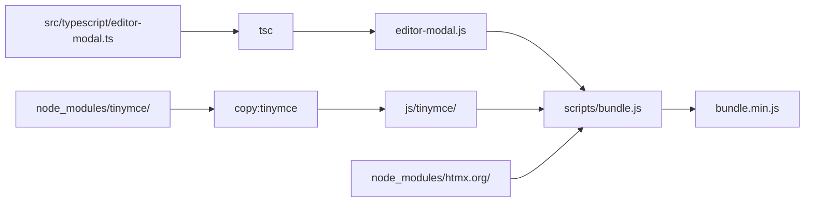

# TypeScript Configuration

This module has been configured to use TypeScript with strict type checking, ESLint for code quality, and Prettier for code formatting.

## File Structure

- `src/typescript/` - TypeScript source files
- `../src/main/content/jcr_root/apps/slingslop/zengarden/js/` - Compiled JavaScript output
- `tsconfig.json` - TypeScript compiler configuration
- `.eslintrc.js` - ESLint configuration
- `.prettierrc` - Prettier configuration
- `package.json` - Node.js dependencies and scripts
- `scripts/bundle.js` - Bundling and minification script

## NPM Scripts

- `npm run build` - Compile TypeScript to JavaScript (includes prebuild and postbuild hooks)
- `npm run copy:tinymce` - Copy TinyMCE from node_modules to JCR content
- `npm run copy:htmx` - Copy htmx (both minified and unminified) from node_modules to JCR content
- `npm run copy:libs` - Copy all libraries (TinyMCE + htmx)
- `npm run bundle` - Create bundled and minified single JS file (htmx + TinyMCE + editor-modal)
- `npm run lint` - Run ESLint checks
- `npm run lint:fix` - Run ESLint with auto-fix
- `npm run format` - Check code formatting with Prettier
- `npm run format:fix` - Auto-format code with Prettier
- `npm run check` - Run all checks (format + lint + build)

## Dependency Management

### TinyMCE
TinyMCE is managed via npm and copied into the JCR content directory during the build:

- **Source**: Installed from npm (`node_modules/tinymce/`)
- **Destination**: `../src/main/content/jcr_root/apps/slingslop/zengarden/js/tinymce/`
- **Version**: Defined in `package.json` (currently ^6.8.2)
- **Loading**: The entire TinyMCE distribution is copied so it can self-load its plugins and skins at runtime.

### htmx
htmx is managed via npm and automatically copied to the JCR content directory during the build:

- **Source**: Installed from npm (`node_modules/htmx.org/dist/`)
- **Destination**: `src/main/content/jcr_root/apps/slingslop/zengarden/js/`
- **Version**: Defined in `package.json` (currently ^1.9.10)
- **Files**: Both `htmx.js` (unminified) and `htmx.min.js` (minified) are copied

### Bundled JavaScript
For production, a single minified bundle is created that includes all JavaScript:

- **Contents**: htmx + TinyMCE core + editor-modal.js
- **Output**: `src/main/content/jcr_root/apps/slingslop/zengarden/js/bundle.min.js`
- **Build**: Automatically created via `npm run bundle` (postbuild hook)
- **Minification**: Uses Terser for optimal compression

All generated files are:
- ✅ Generated during build (via `npm run copy:libs` and `npm run bundle`)
- ✅ Ignored by git (listed in `.gitignore`)
- ✅ Excluded from linting and formatting

To update these libraries:
1. Update the version in `package.json`
2. Run `npm install` to get the new version
3. Run `npm run build` (or `mvn compile`) to copy and bundle the updated files

## Maven Integration

The project uses `frontend-maven-plugin` to automate the build process:

1. **generate-resources phase**:
   - Installs Node.js and npm
   - Runs `npm install` to install dependencies
   - Copies libraries (TinyMCE, htmx) from node_modules to JCR content
2. **process-resources phase**: Runs Prettier format check and ESLint
3. **compile phase**: Compiles TypeScript to JavaScript and creates bundled minified version

When you run `mvn clean install`, it will:
- Install Node.js v24.13.1 and npm 11.10.1 locally
- Install all npm dependencies (including TinyMCE and htmx)
- Copy library files to the JCR content directory
- Check code formatting
- Run linting
- Compile TypeScript to JavaScript
- Create bundled and minified JavaScript (bundle.min.js)
- Package the content

## JavaScript Loading Modes

The application supports two modes for loading JavaScript:

### Development Mode (with URL-parameter)
Loads unminified, separate JavaScript files for easier debugging:
- `htmx.js` - Unminified htmx
- `editor-modal.js` - Compiled from TypeScript

**Access**: Add `?minJs=false` query parameter (e.g., `http://localhost:8080/content/page.html?minJs=false`)

### Production Mode (Minified Bundle)
Loads a single minified bundle containing all JavaScript:
- `bundle.min.js` - Minified and concatenated (htmx + TinyMCE core + editor-modal)

**Access**: Visit any page normally (e.g., `http://localhost:8080/content/page.html`)

**Benefits of bundled mode**:
- ✅ Single HTTP request instead of 2
- ✅ Smaller file size due to minification
- ✅ Faster page load times
- ✅ Better for production deployments
- Run linting
- Compile TypeScript to JavaScript
- Package the content

## Development Workflow

### Local Development

1. Make changes to TypeScript files in `src/typescript/`
2. Run `npm run check` to validate your changes
3. Run `npm run build` to compile to JavaScript
4. Or simply run `mvn compile` to run the full Maven build

### Code Quality

The setup enforces:
- **TypeScript strict mode**: All type checks enabled
- **ESLint**: Code quality rules including TypeScript-specific rules
- **Prettier**: Consistent code formatting

### IDE Integration

Your IDE should automatically pick up the TypeScript, ESLint, and Prettier configurations for real-time feedback.

## Configuration Files

### tsconfig.json
- Strict type checking enabled
- Targets ES2015
- Source root: `src/typescript/`
- Outputs to `../src/main/content/jcr_root/apps/slingslop/zengarden/js/`

### .eslintrc.js
- TypeScript-aware linting
- Prettier integration
- Strict rules for type safety

### .prettierrc
- Single quotes
- 2-space indentation
- 100 character line width
- Trailing commas in ES5 mode

## Troubleshooting

If you encounter issues:

1. **Node/npm not found**: Run `mvn clean` to clear and reinstall Node
2. **Type errors**: Check `tsconfig.json` and ensure types are properly declared
3. **Linting errors**: Run `npm run lint:fix` to auto-fix common issues
4. **Formatting errors**: Run `npm run format:fix` to auto-format code
5. **bundle.js fails — file not found**: Ensure `npm run build` ran first so `editor-modal.js` exists in the output directory
6. **TinyMCE plugins not loading at runtime**: Ensure `copy:tinymce` ran and the `js/tinymce/` directory is present in the JCR content
